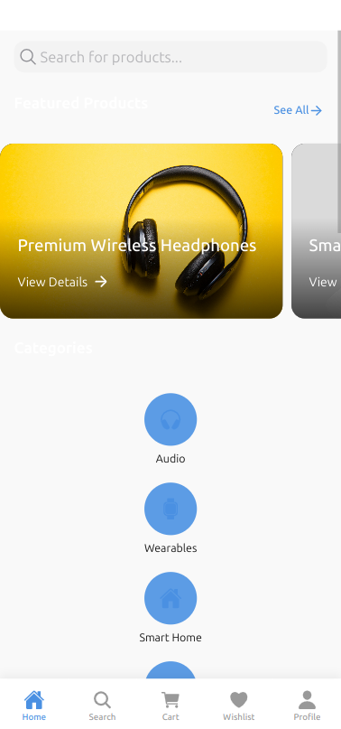

# Ionic E-commerce App

A modern, feature-rich e-commerce mobile application built with Ionic Framework and React. This application provides a complete UI for an e-commerce platform with static data (no backend required).


## Features

- **Clean, Modern UI Design** - Professional and visually appealing interface
- **Multiple Pages** - Complete user flow from splash screen to checkout
- **Static Data** - Mock JSON files for products, categories, and user data
- **Cart Functionality** - Add, remove, update quantities
- **Wishlist** - Save favorite products
- **User Authentication** - Mock authentication flow
- **Responsive Layout** - Works on various device sizes
- **Dark Mode Support** - System preference based theme

## Screenshots

### Home & Product Browsing
<div align="center">
  
  <p><em>Home screen with featured products and categories</em></p>
</div>

### Product Details & Shopping
<div align="center">
  
  <p><em>Product detail page with specifications and reviews</em></p>
</div>

### Shopping Cart & Checkout
<div align="center">
  
  <p><em>Shopping cart management and checkout process</em></p>
</div>

### User Authentication
<div align="center">
  
  <p><em>Login and registration screens</em></p>
</div>


## Pages Included

- **Splash Screen & Onboarding**
- **Authentication**: Login, Registration, Password Recovery
- **Home**: Featured products, categories, special offers
- **Product Browsing**: Category views, search, filters
- **Product Details**: Images, specs, reviews, related products
- **Shopping Cart**: Cart management, promo codes
- **Checkout**: Address, payment, order review
- **User Profile**: Personal info, orders, addresses
- **Wishlist**: Saved products

## Tech Stack

- Ionic Framework 7
- React 18+
- TypeScript
- CSS Modules
- Ionicons

## Getting Started

### Prerequisites

- Node.js (v18+)
- npm (v8+)

### Installation

1. Clone this repository
```bash
git clone https://github.com/yourusername/ionic-ecommerce-app.git
cd ionic-ecommerce-app
```

2. Install dependencies
```bash
npm install
```

3. Start the development server
```bash
npm run start
```

4. Open your browser to `http://localhost:8100`

### Building for Production

```bash
npm run build
```

### Running on a Device

For iOS:
```bash
ionic capacitor add ios
ionic capacitor copy ios
```

For Android:
```bash
ionic capacitor add android
ionic capacitor copy android
```

## Project Structure

```
src/
├── components/         # Reusable UI components
├── contexts/           # React context providers
├── data/               # Static JSON data
├── pages/              # Application pages
├── theme/              # Global styles and variables
└── utils/              # Helper functions
```

## Customization

### Colors

To change the app's color scheme, modify the variables in `src/theme/variables.css`.

### Data

To update the product data, edit the JSON files in the `src/data/` directory.

## License

This project is licensed under the MIT License - see the LICENSE file for details.

## Acknowledgments

- [Ionic Framework](https://ionicframework.com/)
- [Unsplash](https://unsplash.com/) for demo images 